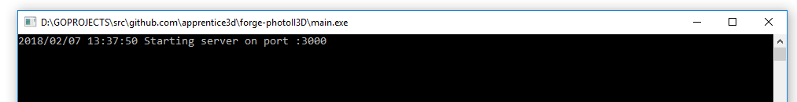

# forge-photoII3D
[](https://travis-ci.org/apprentice3d/forge-photoII3D)
[](https://goreportcard.com/report/github.com/apprentice3d/forge-photoII3D)

[](http://opensource.org/licenses/MIT)

[](https://github.com/Autodesk/hig)


**Forge API:** [](http://developer-autodesk.github.io/)
[](http://developer-autodesk.github.io/)

`forge-photoII3D` is a sample illustrating use of [Forge Reality Capture API](https://developer.autodesk.com/api/reality-capture-cover-page/).

## Setup
Set the ```FORGE_CLIENT_ID``` and ```FORGE_CLIENT_SECRET``` environment
variables with your Forge secrets.

Grab the zip archive from the [releases](https://github.com/apprentice3d/forge-photoII3D/releases) page
and un-archive it into favorite folder.

### Alternative install:
If you have Go already setup, and you want to build it by yourself, run:

    go get -u github.com/apprentice3d/forge-photoII3D

change to created/updated directory:

    cd $GOPATH/src/github.com/apprentice3d/forge-photoII3D

and start it by running

    go run main.go

or build it by running

    go build

## Usage

This app works on `port 3000`, so make sure it is available.

To start the app just run the `forge-photo23d` executable.

If everything is setup, you should see a terminal window like this:



meaning that the web app can be accessed at `http://localhost:3000`

with following workflow:


## Source code usage:
This sample code contains 2 parts:

- a [React](https://reactjs.org/) powered frontend, contained in `frontend_src` folder
- a [Go](https://golang.org/) powered backend, mainly contained in `server` folder

The suggested approach for experiments and development is to:

 1. start the backed by running `go run main.go`
 2. start the frontend by switching to `frontend_src`, installing all
 dependencies by running `npm install` and start the frontend by running `npm start`

 A separate start of the front end is necessary to have all the feature of
 `hot-reloading` activated, so upon saving the changes
 made to code in `frontend_src`, will be "auto-compiled" and reloaded.

 Work on backed is as usual, any changes to the code will become effective
 only after restarting the server.

 When experiments are final, run `npm run buld` within `frontend_src` folder.
 This will create a client folder in the root folder of the project, which
 will contain a transpiled, minimized and bundled version of the frontend,
 for server to serve.

 Finally, after the client was build, the server will serve the frontend from
 that folder.