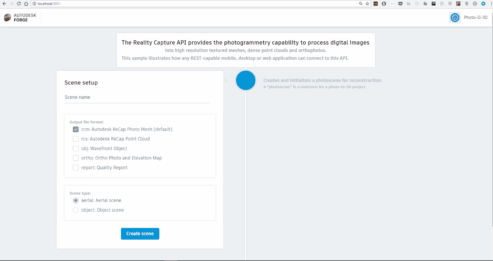

# photoII3D

[](https://travis-ci.org/apprentice3d/forge-photoII3D)
[](https://goreportcard.com/report/github.com/apprentice3d/forge-photoII3D)

[](http://opensource.org/licenses/MIT)

[](https://github.com/Autodesk/hig)


**Forge API:** [](http://developer-autodesk.github.io/)
[](http://developer-autodesk.github.io/)

# Description
This sample illustrates the [Forge Reality Capture API](https://developer.autodesk.com/api/reality-capture-cover-page/)'s photogrammetry workflow:

- Create a photo scene giving certain params (output file, scene type etc.)
- Add photos to a scene (locally or remotely located)
- Initiate Generate a 3D mesh model
- Obtain a download link for the model

### Thumbnail



# Setup
## Prerequisites
1. **Forge Account**: Learn how to create a Forge Account, activate subscription and create an app at [this tutorial](http://learnforge.autodesk.io/#/account/);
2. [Node.Js](https://nodejs.org) and basic knowledge of JavaScript;
3. [Visual Studio Code](https://code.visualstudio.com/) or any other code editor.


## Running locally

Set the ```FORGE_CLIENT_ID``` and ```FORGE_CLIENT_SECRET``` environment
variables with your Forge secrets.

This app works on `port 3000`, so make sure it is available.

1. If you don't have [Go](http://golang.org) installed or don't have the will or skills, grab the zip archive from the [releases](https://github.com/apprentice3d/reality.capture-go-photoII3D/releases) page
and un-archive it into favourite folder.

To start the app just run the `forge-photo23d` executable.


2. If you have Go already setup, and you want to build it by yourself, follow the following steps:

	1. Using the command line, run:

    		go get -u github.com/apprentice3d/forge-photoII3D

		change to created/updated directory:

    		cd $GOPATH/src/github.com/apprentice3d/forge-photoII3D

	2. You have to build the frontend separately,
		thus switch to `frontend_src' and run 

    		npm run build

		that will build (transpile, compress and bundle) the html/js/css code and place it into `client` folder in source root for server to serve.
		
	3. Switch back to the route of this project by running
	
			cd ..
				
		and start the server by running

    		go run main.go


Open a browser and navigate to `http://localhost:3000`
 
# Further Reading

Documentation:

- [OAuth API](https://forge.autodesk.com/en/docs/oauth/v2/)
- [Reality Capture API](https://forge.autodesk.com/en/docs/reality-capture/v1)

Tutorials:

- [Create 3D Mesh from Photos](https://forge.autodesk.com/en/docs/reality-capture/v1/tutorials/create-3d-mesh-from-photos/)

Blogs:

- [Forge Blog](https://forge.autodesk.com/blog/hitchhikers-guide-reality-capture-api)

Other samples:

- [reality.capture-go-photoII3D
](https://github.com/apprentice3d/reality.capture-go-photoII3D)
- [reality.capture-go-cli.sample
](https://github.com/apprentice3d/reality.capture-go-cli.sample)

# Source code structure:
This sample code contains 2 parts:

- a [React](https://reactjs.org/) powered frontend, contained in `frontend_src` folder
- a [Go](https://golang.org/) powered backend, mainly contained in `server` folder

The suggested approach for experiments and development is to:

 1. start the backed by running `go run main.go`
 2. go to frontend by switching to `frontend_src`, installing all
 dependencies by running `npm install` and start the frontend by running `npm start`

 A separate start of the front end is necessary to have all the feature of
 `hot-reloading` activated, so upon saving the changes
 made to code in `frontend_src`, will be "auto-compiled" and reloaded.

 Work on backed is as usual, any changes to the code will become effective
 only after restarting the server.

 When experiments are final, run `npm run buld` within `frontend_src` folder.
 This will create a client folder in the root folder of the project, which will contain a transpiled, minimized and bundled version of the frontend,for server to serve.

 Finally, after the client was build, the server will serve the frontend from that folder.


# License

This sample is licensed under the terms of the [MIT License](http://opensource.org/licenses/MIT). Please see the [LICENSE](LICENSE) file for full details.

# Written by

Denis Grigor [denis.grigor@autodesk.com](denis.grigor@autodesk.com), [Forge Partner Development](http://forge.autodesk.com)


